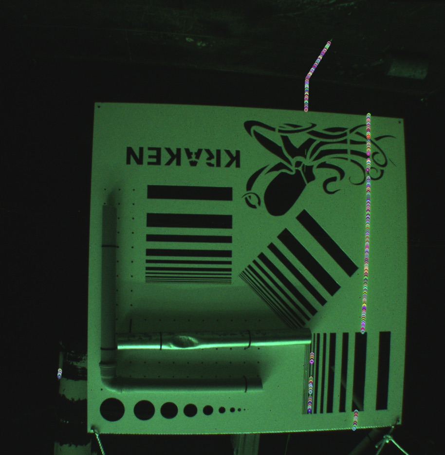

# OpenCV - Playground

This project is for playing with OpenCV, which is one of our core libraries for
image processing. One very challenging processing step for SeaVision (our
underwater structured light system) is to reliably extract
possible laser line candidates in raw images.

There are three sample images in the folder 'raw_data' recorded by our embedded
camera. For the first image, the result of our detector is displayed below. It
can detect the green laser line quite successfully but still has some outliers:

The task is to use the skeleton provided in the folder 'src' to write your own
detector, which can detect the laser line in the provided images. The last
image is highly challenging because an RGB laser is used with 5deg separation
between each laser line. Below are some additional hints:

* the camera has a GBRG Bayer pattern 
* a valid solution is to have a naive implementation and name potential improvements during a short discussion 
* the task is designed for 4h

Happy puzzling.
